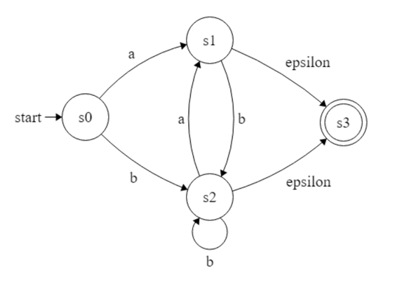
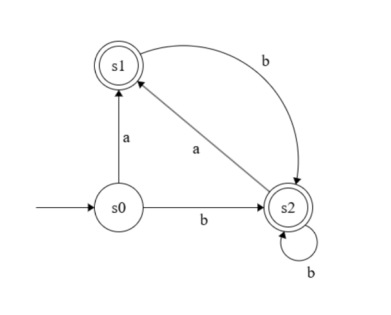

### Here are the answers to exercise 3.2

Regex:
^(a|b|ba)?(ba|b)*$

NFA:

| DFA state | move(a) | move(b) | NFA states |
|-----------|---------|---------|------------|
| s0        | s1      | s2      | s0={0}     |
| s1        | -       | s2      | s1={1,<ins>3</ins>}   |
| s2        | s1      | s2      | s2={2,<ins>3</ins>}   |

DFA:

